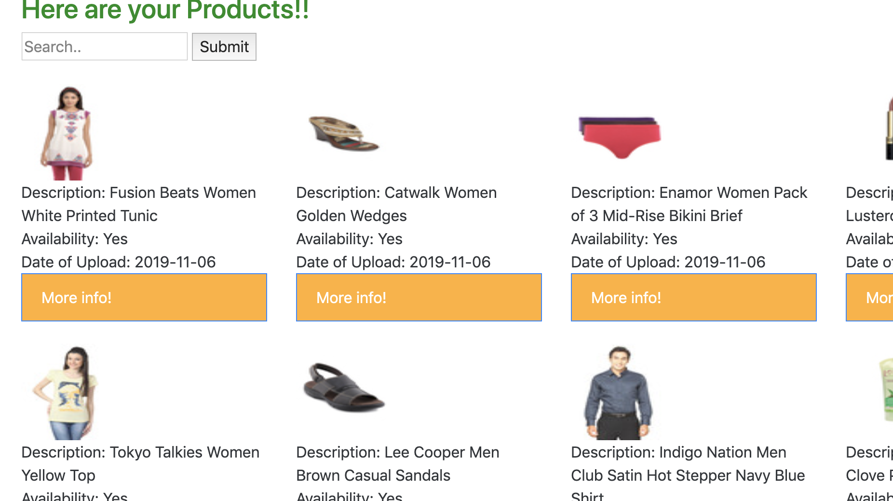

# Rental-Marketplace

Rental Marketplace is a platform that consists of products for renting purposes only. It is a platform for uploading and viewing a product, and to facilitate communication between the renter and the consumer. It acts as an interface where the renter can list his/her products along with information related to it, and the consumer can search and rent the products when it is neededthe most and return it later. This platform does not involve intransactions between the renter and the consumer and does not have any legal obligations to any/all parties.  

Team:  
Buvaneish Sundar  
Pranay Dhariwal  
Srujana Bhaskarabhatta  

App Images:

